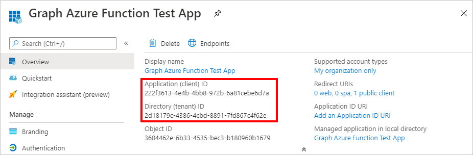

<!-- markdownlint-disable MD002 MD041 -->

En este ejercicio, creará tres nuevas aplicaciones de Azure AD con el centro de administración de Azure Active Directory:

- Un registro de aplicaciones para la aplicación de una sola página para que pueda iniciar sesión en los usuarios y obtener tokens, lo que permite que la aplicación llame a la función de Azure.
- Un registro de aplicaciones para la función de Azure que permite usar el [flujo en nombre de](https://docs.microsoft.com/azure/active-directory/develop/v2-oauth2-on-behalf-of-flow) para intercambiar el token enviado por el Spa para un token que le permita llamar a Microsoft Graph.
- Un registro de aplicaciones para el webhook de Azure function que permite usar el [flujo de credenciales de cliente](https://docs.microsoft.com/azure/active-directory/develop/v2-oauth2-client-creds-grant-flow) para llamar a Microsoft Graph sin un usuario.

> [!NOTE]
> Este ejemplo requiere tres registros de aplicaciones porque está implementando el flujo en nombre de y el flujo de credenciales de cliente. Si la función de Azure solo usa uno de estos flujos, solo tendrá que crear los registros de la aplicación que correspondan a ese flujo.

1. Abra un explorador y vaya al [centro de administración de Azure Active Directory](https://aad.portal.azure.com) e inicie sesión con un administrador de la organización del arrendatario de Microsoft 365.

1. Seleccione **Azure Active Directory** en el panel de navegación izquierdo y, a continuación, seleccione **Registros de aplicaciones** en **Administrar**.

    

## Registrar una aplicación para la aplicación de una sola página

1. Seleccione **Nuevo registro**. En la página **Registrar una aplicación** , establezca los valores siguientes.

    - Establezca **Nombre** como `Graph Azure Function Test App`.
    - Establezca los **tipos de cuenta admitidos** **solo en las cuentas de este directorio de organización**.
    - En **URI de redireccionamiento** , cambie la opción desplegable a **aplicación de una sola página (Spa)** y establezca el valor en `http://localhost:8080` .

    

1. Seleccione **Registrar**. En la página aplicación de prueba de la **función de Azure Graph** , copie los valores del identificador de la **aplicación (cliente)** y el **identificador del directorio (inquilino)** y guárdelos, los necesitará en los pasos posteriores.

    

## Registrar una aplicación para la función de Azure

1. Vuelva a **registros de aplicaciones** y seleccione **nuevo registro**. En la página **Registrar una aplicación** , establezca los valores siguientes.

    - Establezca **Nombre** como `Graph Azure Function`.
    - Establezca los **tipos de cuenta admitidos** **solo en las cuentas de este directorio de organización**.
    - Deje el **URI de redireccionamiento** en blanco.

1. Seleccione **Registrar**. En la página de la **función Graph Azure** , copie el valor del identificador de la **aplicación (cliente)** y guárdelo, lo necesitará en el paso siguiente.

1. Seleccione **Certificados y secretos** en **Administrar**. Seleccione el botón **Nuevo secreto de cliente**. Escriba un valor en **Descripción** y seleccione una de las opciones para **Expires** y seleccione **Agregar**.

    

1. Copie el valor del secreto de cliente antes de salir de esta página. Lo necesitará en el siguiente paso.

    > [!IMPORTANT]
    > El secreto de cliente no se vuelve a mostrar, así que asegúrese de copiarlo en este momento.

    

1. Seleccione **permisos de API** en **administrar**. Elija **Agregar un permiso**.

1. Seleccione **Microsoft Graph** y, a continuación, **permisos delegados**. Agregue **mail. Read** y seleccione **Add Permissions**.

    

1. Seleccione **exponer una API** en **administrar** y, a continuación, elija **Agregar un ámbito**.

1. Acepte el **URI de identificador de aplicación** predeterminado y elija **Guardar y continuar**.

1. Rellene el formulario **Agregar un ámbito** de la siguiente manera:

    - **Nombre de ámbito:** Mail. Read
    - ¿ **Quién puede dar su consentimiento?:** Administradores y usuarios
    - **Nombre para mostrar de consentimiento de administración:** Leer las bandejas de correo de todos los usuarios
    - **Descripción del consentimiento del administrador:** Permite que la aplicación Lea las bandejas de correo de todos los usuarios.
    - **Nombre para mostrar del consentimiento del usuario:** Leer la bandeja de entrada
    - **Descripción del consentimiento del usuario:** Permite que la aplicación lea su bandeja de entrada
    - **Estado:** Preparado

1. Seleccione **Agregar ámbito**.

1. Copie el nuevo ámbito, lo necesitará en pasos posteriores.

    

1. Seleccione **manifiesto** en **administrar**.

1. Busque `knownClientApplications` en el manifiesto y reemplace su valor actual `[]` por `[TEST_APP_ID]` , donde `TEST_APP_ID` es el identificador de aplicación del registro de aplicaciones de la aplicación de prueba de la **función de Azure de Graph** . Seleccione **Guardar**.

> [!NOTE]
> Agregar el identificador de aplicación de la aplicación de prueba a la `knownClientApplications` propiedad en el manifiesto de la función de Azure permite que la aplicación de prueba desencadene un [flujo de consentimiento combinado](https://docs.microsoft.com/azure/active-directory/develop/v2-oauth2-on-behalf-of-flow#default-and-combined-consent). Esto es necesario para que funcione el flujo en nombre de.

## Agregar ámbito de función de Azure para probar el registro de aplicaciones

1. Vuelva al registro de la **aplicación de prueba** de la función de Azure y seleccione permisos de **API** en **administrar**. Seleccione **Agregar un permiso**

1. Seleccione **mis API** y, después, seleccione **cargar más**. Seleccione la **función de Microsoft Graph Azure**.

    

1. Seleccione el permiso **mail. Read** y, a continuación, seleccione **Agregar permisos**.

1. En los **permisos configurados** , quite el permiso **User. Read** en **Microsoft Graph** seleccionando **...** a la derecha del permiso y seleccionando **quitar permiso**. Seleccione **sí, quitar** para confirmar.

    

## Registrar una aplicación para el webhook de la función de Azure

1. Vuelva a **registros de aplicaciones** y seleccione **nuevo registro**. En la página **Registrar una aplicación** , establezca los valores siguientes.

    - Establezca **Nombre** como `Graph Azure Function Webhook`.
    - Establezca los **tipos de cuenta admitidos** **solo en las cuentas de este directorio de organización**.
    - Deje el **URI de redireccionamiento** en blanco.

1. Seleccione **Registrar**. En la página **webhook de la función de Azure Graph** , copie el valor del identificador de la **aplicación (cliente)** y guárdelo, lo necesitará en el paso siguiente.

1. Seleccione **Certificados y secretos** en **Administrar**. Seleccione el botón **Nuevo secreto de cliente**. Escriba un valor en **Descripción** y seleccione una de las opciones para **Expires** y seleccione **Agregar**.

1. Copie el valor del secreto de cliente antes de salir de esta página. Lo necesitará en el siguiente paso.

1. Seleccione **permisos de API** en **administrar**. Elija **Agregar un permiso**.

1. Seleccione **Microsoft Graph** y, a continuación, permisos de la **aplicación**. Agregue **User. Read. All** y **mail. Read** y, a continuación, seleccione **Agregar permisos**.

1. En los **permisos configurados** , quite el **usuario delegado.** permiso de lectura en **Microsoft Graph** seleccionando **...** a la derecha del permiso y seleccionando **quitar permiso**. Seleccione **sí, quitar** para confirmar.

1. Seleccione el botón **conceder consentimiento del administrador para...** y seleccione **sí** para conceder el consentimiento del administrador para los permisos de la aplicación configurada. La columna **Estado** de la tabla **permisos configurados** cambia a **concedido para...**.

    
